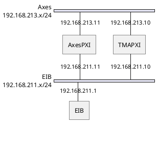
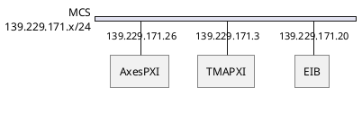

# EtherCATLineDiagnostic

| **Requested by:** | **AURA**   |
| ----------------- | ---------- |
| **Doc. Code**     | --         |
| **Editor:**       | A. Izpizua |
| **Approved by:**  | J. Garcia  |

## Index

- [EtherCATLineDiagnostic](#ethercatlinediagnostic)
  - [Index](#index)
  - [Introduction](#introduction)
  - [Receiving Time Analysis](#receiving-time-analysis)
  - [Data Late Analysis](#data-late-analysis)
  - [Telemetry](#telemetry)
  - [Conclusions](#conclusions)

## Introduction

This document shows the analysis of the data from the axes telemetry. The idea is to validate the new communication path from the EIB to AXES PXI.

In the baseline network configuration, there were two independent VLANs, one for EIB communication and the another one for commanding and telemetry.

In the EIB VLAN the TMAPXI communicates with the EIB using TCP.
This communication is used to configure the EIB or to check the status at startup or during an axis Home process.
The EIB sends data to the AxesPXI using UDP. Each data package sent by the EIB is composed by position, reference[^1],
speed and status info for all heads (azimuth and elevation) and it is sent every 1ms.
The Axes VLAN is used to transmit the telemetry from the AxesPXI to the TMAPXI and to send commands from the TMAPXI to the AxesPXI.
Telemetry is sent every 50ms, but commanding is asynchronous when the axes are not in tracking mode. 
In tracking mode, commands arrive every 50ms from TMAPXI.

[^1]: reference data is used to calculated the absolute position.

In the new network configuration only one VLAN is used, so all the data flows from/to the same NIC in the AxesPXI

In both cases the VLANs are located in the IE3200 switch.

In the baseline network configuration, the data was obtained from the last observation night before M1M3 was installed (2023-03-29),
when both axes were enabled and commanded from the CSC.

In the current network configuration the axes are commanded by the EUI and only azimuth axis is used. Azimuth torque command is 0.
Data was obtained in specific tests (2023-05-12 and 2023-05-15)

The baseline has more network traffic since the tracking commands are also in the system every 50ms, from the TMAPXI to the AxesPXI.

## Receiving Time Analysis

The axes control algorithm publishes timing data to the EUI. This timing data has the timestamp after receiving the data package from the EIB
and the timestamp when the axis control loop uses this data.

Comparing this two values, the time margin is obtained. This value must be lower than 1ms.
The lower the time margin is the worse the communication is. There is no other change at this moment,
so this relation is directly caused by network changes.

In the graph below, the baseline timing is shown. Most data is between 750 us to 810 us.

If a zoom is done in any random place in the graph, the behavior is repetitive every about 30ms.

Analyzing the time between iterations, the control loop has a jitter of about 30 us, while the jitter for receiving data from the EIB is about 60us.

For the new configuration, the data shows more time variance. Most data is between 580 us and 830 us.

If a zoom is done in any random place, a more erratic behavior appears, but there is a great timing drop every 50 ms.
This 50 ms is the telemetry publication frequency, so it can be assumed that this is due the interference between both communications (the incoming UDP data from the EIB and the outgoing data to the TMAPXI)

Analyzing the time between iterations, the jitter of the control loop is very similar, but the received data jitter increases to 460 us.

## Data Late Analysis

The data late analysis gives similar results in the baseline and new configuration.
The number of warnings are similar (in the new configuration, alarms are more often because the threshold has been lowered).

## Telemetry

Looking at the time between iterations, in the new configuration, a peak of 2000 ms or more appears every 10 min.
This 2000 ms means that one iteration is not processed by the control loop or that one of the iterations has been lost in the telemetry
(AxesPXI buffer is fulfilled and data is lost). As nothing changes in the control loop, it can be assumed that the issue
is related with the new network configuration that makes the system slower. The AxesPXI does not send Telemetry data
fast enough to avoid overwriting oldest data (this means telemetry data is lost).

In the baseline design, there are no peaks over 1220 ms for receiving data, and over 1060 for processing data.

In the new configuration, in all analyzed data there is always a peak of at least 2000 ms, as shown in next figure.

## Conclusions

A clear degradation of the system is shown in this report.
The use of only one NIC for all the data transfers in the AxesPXI increases the stress in the system, reducing its performance.

Tekniker recommends using a separate VLAN to communicate with the EIB.
