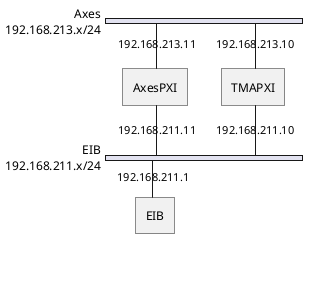
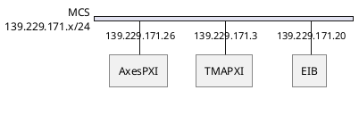

# EtherCATLineDiagnostic

| **Requested by:** | **AURA**   |
| ----------------- | ---------- |
| **Doc. Code**     | --         |
| **Editor:**       | A. Izpizua |
| **Approved by:**  | J. Garcia  |

## Index

- [EtherCATLineDiagnostic](#ethercatlinediagnostic)
  - [Index](#index)
  - [Introduction](#introduction)
  - [Receiving Time Analysis](#receiving-time-analysis)
  - [Data Late Analisys](#data-late-analisys)
  - [Telemetry](#telemetry)
  - [Conclusions](#conclusions)

## Introduction

This document shows the analysis of the data from the axes telemetry. The idea is to validate the new communication path from the EIB to AXES PXI.

In the baseline network configuration there were two independents VLANs, one for EIB communication and the other for commanding and telemetry.

In the EIB VLAN the TMAPXI communicates with EIB using TCP.
This communication is used to configure the EIB or to check the status at startup or during a axis Home process.
The EIB sends data to the AxesPXI using UDP. Each data package sent by EIB has position, reference[^1], speed and status info and it is sent every 1ms.
The Axes VLAN is used to transmit the telemetry from the AxesPXI to the TMAPXI and to send commands from the TMAPXI to AxesPXI.
Telemetry is sent every 50ms, but commanding is asynchronous when the axes are not in tracking mode. In tracking mode, commands arrive every 50ms from TMAPXI.

In the new network configuration only one VLAN is used, so all the data flows from/to the same NIC in the AxesPXI

[^1]: reference data is used to calculated the absolute position.

In both cases the VLANs are located in the IE3200 switch.

In the baseline network configuration, the data is obtained from the last observation night before M1M3 is installed (2023-03-29), where both axes are enabled and commanded from the CSC.

In the current network configuration the axes are commanded by the EUI and only azimuth axis is used. Azimuth torque command is 0. Data is obtained in specific tests (2023-05-12 and 2023-05-15)

The baseline has more network traffic since the tracking commands are also in the system every 50ms, coming from the TMAPXI to the AxesPXI.

## Receiving Time Analysis

The axes control algorithm publish timing data to the EUI. This timing data has the timestamp after receiving data package from EIB and the timestamp when axis control loop uses this data.

Comparing this two values, we get the time margin.This value must be lower than 1ms.
The lower the time margin is the worse the communication is. There is no other thing changed at this moment, so this relation is direct.

In next graph the baseline timing is shown. Most data is between 750 us to 810 us.

If a zoom is done in any random place in the graph, the behavior is repetitive every about 30ms.

Analyzing the time between iterations, the control loop has a jitter about 30 us, while the time for receiving data from encoder is about 60us

For the new configuration, the data shows more time variance. Most data is between 580 us and 830 us

If a zoom is done in any random position, appears a more erratic behavior, but it shows a great timing drop every 50 ms. This 50 ms is the telemetry frequency.

Analyzing the time between iterations, the jitter of the control loop is very similar, but the received data jitter is increases to 460 us.

## Data Late Analisys

The data late analysis give similar results in the baseline and new configuration. The number of warnings are similar (in new configuration, alarms are more often because the threshold has been reduced).

## Telemetry

Looking at the time between iterations, in the new configuration, every 10 min appears a peak of 2000 ms or more. This 2000 ms means that on iteration is not processed by the control loop or one of the iterations has been lost in the telemetry (AxesPXI buffer is fulfilled and data is lost).

In the baseline design, there are no times over 1220 ms for receiving data, and over 1060 for processing data.

In the new configuration, in all analyzed data there is always a peak of at least 2000 ms, as shown in next figure.

## Conclusions

A clear degradation of the system is shown in this report. The use of only one NIC for all the data in the axes PXI makes the system more in the edge.

Tekniker recommends to use a separate VLAN to communicate with the EIB.
